# 🛡️ RPG Skill Tree Generator

Un generador de árboles de habilidades interactivos diseñados para videojuegos en formato **SVG**. Ideal para currículums visuales, portafolios RPG o dashboards de progreso técnico.

## 🕹️ Características
- **Geometría Dinámica:** El núcleo y las ramas mutan (triángulo, cuadrado, etc.) según el número de hijos que tengan. No son solo círculos.
- **Layout Radial Automático:** Posicionamiento inteligente en 360° basado en el orden del JSON.
- **Interactividad Pura:**
  - **Hover:** Brillo y escalado de nodos.
  - **Click:** Desbloqueo de habilidades con animación de "pop" y flujo de energía visual.
  - **HUD Táctico:** Panel inferior que muestra el estado del enlace neuronal.
- **Sin Dependencias:** Todo el SVG contiene su propio CSS y JavaScript.

---

## 🎨 Plantillas de Ejemplo

Para empezar, crea un archivo `skills.json` y pega uno de estos ejemplos:

<details>
<summary>🚀 <b>Fullstack Architect</b> (Ideal para Portfolios)</summary>

```json
{
    "theme": {
        "background": "#0d1117",
        "text": "#c9d1d9",
        "primary": "#58a6ff",
        "coreLabel": "Fullstack\\nArchitect",
        "glow": true,
        "sizes": {
            "coreRadius": 75, "coreText": 18,
            "categoryRadius": 95, "categoryText": 12,
            "skillRadius": 40, "skillText": 12
        }
    },
    "categories": [
        {
            "name": "Frontend", "color": "#3178c6", "start": 0,
            "skills": [
                { "name": "React", "level": 85, "color": "#61dafb", "rarity": "rare" },
                { "name": "TypeScript", "level": 90, "color": "#3178c6", "rarity": "epic" }
            ]
        },
        {
            "name": "Backend", "color": "#339933", "start": 1,
            "skills": [
                { "name": "Node.js", "level": 80, "color": "#339933" },
                { "name": "Bun", "level": 85, "color": "#fbf0df", "rarity": "epic" }
            ]
        }
    ]
}
```
</details>

<details>
<summary>🧙‍♂️ <b>RPG Archmage Path</b> (Uso de Joins y Efectos Visuales)</summary>

```json
{
    "theme": {
        "background": "#0a0a14",
        "text": "#ffd700",
        "primary": "#ff3c00",
        "coreRotation": 45,
        "coreLabel": "Archmage\\nPath",
        "glow": true,
        "sizes": {
            "coreRadius": 85, "coreText": 22,
            "categoryRadius": 105, "categoryText": 14,
            "skillRadius": 45, "skillText": 13
        }
    },
    "categories": [
        {
            "name": "Fire Mastery", "color": "#ff4500", "start": 0,
            "skills": [
                { "name": "Fireball", "level": 10, "color": "#ff8c00" },
                { "name": "Inferno", "level": 5, "color": "#ff4500", "joins": [
                    { "name": "Dragon Breath", "curvature": 50, "label": "ULTIMATE CALL" }
                ]},
                { "name": "Dragon Breath", "level": 3, "rarity": "epic", "sides": 3 }
            ]
        }
    ]
}
```
</details>

---


## 🗺️ Guía de Diseño (Jerarquía JSON)

¿Cómo saber dónde aparecerá cada rama? El generador utiliza una **lógica de reloj (clockwise)** muy sencilla:

### 1. Categorías (Ramas Principales)
El orden en el array `categories` del JSON define su posición empezando siempre por "las 12":
- **Índice 0:** Arriba (12:00).
- **Siguientes índices:** Se distribuyen hacia la **derecha** (horario).
  - *Ejemplo:* Si tienes 4 categorías (Frontend, Backend, Tools, Frameworks), estas formarán una cruz (Norte, Este, Sur, Oeste).

### 2. Habilidades (Skills)
Se despliegan en abanico desde la punta exterior de su categoría:
- Las líneas de conexión nacen **exactamente de cada vértice** de la figura (triángulo, cuadrado, pentágono).
- El núcleo central también adapta su forma para apuntar directamente a cada categoría.

### 3. Motor de Geometría y Red de Energía (Guía Avanzada)

A veces el enrutamiento automático de los cables cruza nodos o textos, por lo que el motor te ofrece **control quirúrgico** sobre cada unión mediante un sistema hiper-simplificado de Puntos de Inicio (`start`) y Fin (`end`). Todas las figuras geométricas del SVG (Triángulos, Hexágonos...) tienen sus "puntas" (vértices) numeradas empezando desde el `0` en sentido horario.

> 🛠️ **El Truco de Diseño (Modo Debug):** Antes de intentar adivinar qué número es qué punta, activa el modo debug añadiendo `"debug": true` dentro del bloque `"theme"` en tu `skills.json`. Esto imprimirá unas "pegatinas" con el número exacto sobre cada vértice de tu SVG en tiempo real. ¡Úsalo mientras diseñas!

#### 🔧 A: Controlando las Líneas Base (Categorías $\rightarrow$ Habilidades)

- **`start`** (En Categorías y Skills): Índice del vértice desde donde la línea nace.
- **`end`** (En Skills y Joins, Opcional): Índice del vértice donde la línea aterriza.
- **`color`** (En Skills y Joins, Opcional): Color hexadecimal que sobrescribe el color heredado de la categoría.
- **`sides`** (En Skills, Opcional): Número de vértices de la figura (ej. `3` triángulo, `4` cuadrado/rombo, `6` hexágono).
- **`rotation`** (En Skills, Opcional): Rotación de la figura en radianes.
- **`style`** (En Skills y Joins, Opcional): Patrón de trazo del borde/raíz: `"solid"`, `"dashed"`, `"dotted"`, `"sparse"`.
- **`speed`** (En Skills y Joins, Opcional): Duración (en segundos) de la animación de flujo; `0` la desactiva.
- **`direction`** (En Skills y Joins, Opcional): Controla la dirección del flujo: `"node-out"` (por defecto), `"node-in"`, `"center-out"`, `"center-in"`, `"alternate"`.
- **`label`** (En Joins, Opcional): Texto que se muestra sobre la curva.
- **`joins`** (En Skills, Opcional): Array de conexiones adicionales; cada objeto puede contener `name`, `start`, `end`, `vertex`, `curvature`, `color`, `style`, `speed`, `direction`, `label`.
- **`curvature`** (En Joins, Opcional): Valor numérico que controla la curvatura de la línea (positivo = curva externa, negativo = interna).
- **`level`** (En Skills, Opcional): Valor numérico que indica la experiencia o peso del nodo.
- **`rarity`** (En Skills, Opcional): Clasificación RPG que afecta el color de brillo: `"common"`, `"rare"`, `"epic"`, `"legendary"`.
- **`rotation`** (En Categorías, Opcional): Rotación del conjunto de habilidades de la categoría en grados.
- **`color`** (En Categorías, Opcional): Color base de la categoría que se hereda por defecto.
- **`joins`** (En Skills, Opcional): Conexiones avanzadas entre nodos, con sus propios atributos de estilo y animación.
*Ejemplo de uso:*
```json
{
  "name": "Frontend",
  "start": 0, // Sale por la punta '0' (Norte) del núcleo central
  "skills": [
    {
      "name": "React",
      "level": 80,
      "start": 2, // La línea nace de la punta '2' de la categoría Frontend
      "end": 4    // Y la línea aterriza/engancha en la punta '4' del hexágono de React
    }
  ]
}
```

#### ⚡ B: Enlaces entre Vías Múltiples (El atributo `joins`)

Las verdaderas ramas de un skill tree crecen entre distintos mundos (ej: unir Rust en Backend con Tauri en Frameworks). Aquí entra el atributo `joins` (se usa dentro de la habilidad "Origen"). Así construyes puentes intersectoriales:

> 👑 **Pro-Tip (Rutas Doradas / Conexiones Épicas):** Lo que de verdad impresiona en un CV no son iconos sueltos, sino crear **una cadena lógica** que cuente una historia visual. Usa varios `joins` en cadena para dibujar una *Ruta Épica*. Ejemplo: Haz que *Git* apunte a *GitHub Actions*, y que este apunte a *Docker*. Cuando un reclutador vea ese hilo iluminarse consecutivamente pensará: *"Ah, esta es su ruta de despliegue modular"*. ¡Usa el JSON de forma creativa!

- **`name`**: El nombre exacto de la Habilidad a la que quieres lanzar la línea de energía.
- **`start`**: ¿Desde qué punta *de tu habilidad actual (origen)* quieres que *nazca y salga* este nuevo cable de datos?
- **`end`**: ¿A qué punta *de la habilidad de destino* *llegará* el cable?
- **`curvature` (Física Arc):** Determina si el cable es recto o curvo. `0` es una línea rectísima, un número positivo empuja la curva hacia afuera y un número negativo la comba hacia adentro.
- **`color`:** ¡Personaliza la energía de la línea! (Ej: El amarillo miel de JavaScript `#f7df1e`).
- **`label`:** Añade texto que orbita sobre la curva, ideal para diagramar pipelines (ej: `"DATA PIPELINE"`).
- **`style`:** El patrón del propio rayo de luz: `"solid"` (continuo), `"dotted"` (punteado), `"dashed"` (rayas clásicas), o `"sparse"` (espaciado largo).
- **`speed`:** Modificador numérico para la animación. Un número bajo como `0.2` va súper veloz, `1.5` es muy lento y pesado, y `0` la congela para un diseño minimalista estático.
- **`direction`:** Controla la fluidez: `"node-out"` (de origen a destino, por defecto), `"node-in"` (del destino al origen), `"center-out"` (energía revienta desde el centro hacia los dos nodos a la vez), `"center-in"` (la energía nace en ambos nodos y colisiona en el centro del cable), o `"alternate"` (rebota de lado a lado).

*Ejemplo de unión quirúrgica:*
```json
{
  "name": "Rust",
  "level": 85,
  "start": 1,
  "joins": [
    {
      "name": "Tauri",
      "start": 4, 
      "end": 1, 
      "color": "#e67e22",
      "curvature": 90,
      "style": "solid",
      "speed": 0,
      "label": "NATIVE DESKTOP APPS"
    }
  ]
}
```

#### 🔹 C: Habilidades Metamórficas (Evolución Geométrica)
El árbol de vida calculará de manera puramente matemática la figura geométrica de tus habilidades basándose en el "volumen" de su red (sus entradas + salidas totales). Si añades conexiones, la forma muta para adaptarse como lo haría un "socket" de placa electrónica base:
- **1 Conexión en total** (Hoja Final): La figura será un *Círculo Perfecto* (36 lados geométricos).
- **2 Conexiones** (Router o Puente Lineal): La figura será un *Hexágono Clásico* (ofreciendo puertos de paso estéticos).
- **3 Conexiones** (Hub de Enrutamiento): Muta a un *Triángulo*.
- **4 o más Conexiones** (Núcleo superdenso): Evoluciona a Diamantes, Pentágonos, etc.

---

## 🚀 Cómo usar

1. **Instalar Dependencias:**
   ```bash
   bun install
   ```

2. **Configurar:**
   Edita `config/skills.json`. Define los nombres, colores, niveles y rarezas (`common`, `rare`, `epic`, `legendary`).

3. **Generar:**
   ```bash
   bun run src/generateSvg.js
   ```

4. **Ver:**
   Abre el archivo `output/skill-tree.svg` en cualquier navegador web moderno (Brave, Chrome, Firefox, Safari).

---

## 📂 Integración en GitHub (README.md)

Si quieres mostrar tu árbol de habilidades en el `README.md` de tu perfil o repositorio:

### 1. Como Imagen Estática (Recomendado)
Copia el archivo `output/skill-tree.svg` a tu repositorio y usa este código:
```markdown

```
> **Nota:** GitHub por seguridad desactiva el JavaScript dentro de las imágenes en el README. Se verá el árbol completo y nítido, pero no será interactivo (los clicks no funcionarán).

### 2. Para ver la Interactividad (Link)
Para que los usuarios puedan "jugar" con tu árbol (desbloquear nodos, ver animaciones), añade un enlace directo al archivo:
```markdown
[🕹️ Pulsa aquí para abrir el Árbol Interactivo (Versión Full)](output/skill-tree.svg)
```

### 3. Como Widget (GitHub Pages) - Opcional
Si activas **GitHub Pages** en tu repositorio, puedes apuntar a la URL de la página para que el SVG se cargue como una web completa y mantenga el 100% de sus funciones.

---

## 🤖 Automatización con GitHub Actions

Para que tu Skill Tree se actualice solo (perfecto para tu perfil), la mejor práctica es usar una **rama de salida (`output`)**. Esto separa el código de las imágenes generadas.

---

### Opción A: Configuración Profesional (Rama `output`)

#### 1. Estructura de tu repositorio
No necesitas tener carpetas de salida, la acción las creará por ti en una rama separada:
```text
mi-repo/
├── .github/workflows/
│   └── skill-tree.yml
└── config/
    ├── skills-dark.json  <-- Configuración nocturna
    └── skills-light.json <-- Configuración diurna
```

#### 2. Crea el Workflow
Pega este contenido en `.github/workflows/skill-tree.yml`. Generará **dos archivos** (uno oscuro y uno claro) y los subirá automáticamente a una rama llamada `output`.

```yaml
name: Generate Skill Tree

on:
  push:
    paths: ['config/*.json']
  workflow_dispatch:

permissions:
  contents: write

jobs:
  generate:
    runs-on: ubuntu-latest
    steps:
      - uses: actions/checkout@v4

      # Generar versión Oscura
      - name: Generate Dark SVG
        uses: Daviz2402/SkillTree@main
        with:
          config-path: 'config/skills-dark.json'
          output-path: 'output/skill-tree-dark.svg'

      # Generar versión Clara
      - name: Generate Light SVG
        uses: Daviz2402/SkillTree@main
        with:
          config-path: 'config/skills-light.json'
          output-path: 'output/skill-tree-light.svg'

      # Subir a la rama 'output'
      - name: Deploy to Output Branch
        uses: JamesIves/github-pages-deploy-action@v4
        with:
          folder: output
          branch: output
```

#### 3. ¡Úsalo en tu README!
Ahora puedes usar esta etiqueta dinámica que cambia de color según el sistema del usuario (oscuro o claro):

```html
<p align="center">
  <picture>
    <source media="(prefers-color-scheme: dark)" srcset="https://raw.githubusercontent.com/TU_USUARIO/TU_REPO/output/skill-tree-dark.svg">
    <source media="(prefers-color-scheme: light)" srcset="https://raw.githubusercontent.com/TU_USUARIO/TU_REPO/output/skill-tree-light.svg">
    
  </picture>
</p>
```

---

### Opción B: Automatización Integrada (Si has hecho un Fork)

Si has hecho un **Fork** de este repositorio oficial:

1. Ve a la pestaña **Actions** de tu fork y habilita los flujos de trabajo (botón "Enable Actions").
2. Edita el archivo `config/skills.json` directamente en GitHub o localmente.
3. El archivo `.github/workflows/build.yml` ya está configurado para ejecutarse en cada push a `main` y actualizar el SVG en la carpeta `output/` de la misma rama.

---


---

## 📜 Licencia

Este proyecto está bajo una **Licencia de Uso Personal y No Comercial**. Consulta el archivo [LICENSE](./LICENSE) para más detalles.

---
